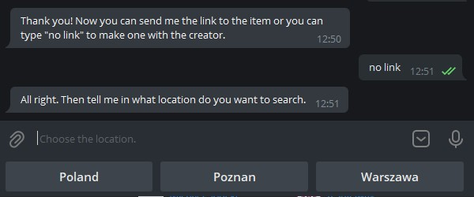

# OLX NOTIFIER

## Description

**OLX_Notifier** is a Telegram bot which finds new offers on OLX. All you have to do is provide the name of an item you
want to be updated about and **OLX_Nofitier** will take care of the rest. \
Everytime there is a new offer of the item you will be notified on Telegram.

### Bot Features

**OLX_Notifier** has a lot of commands which makes the usage very intuitive and convenient.

Type:

- `/start` to start the conversation
- `/help` to contact the creator (me)
- `/add` to add new item to your list \
  This feature is the most extensive one. More about it later in the README file.
- `/set` to set the timer
- `/unset` to unset the timer
- `/delete` to delete a record from your list
- `/mydata` to see your list of items

## Usage

### First step

To use the **OLX_Notifier** just click the following link: https://t.me/motorki_notifier_bot and start chatting.

**IMPORTANT** \
Remember to start the conversation with `/start`. Otherwise the bot won't work properly.

### Second step

1. Type the `/add` command to add an item to your list.
**OLX_Notifier** will ask you about the name of the item. Remember that is it really important to use a meaningful and unique name. \
For example purposes let's assume that we want to search for a cross motor.
Let's type *cross*.

2. Now you have two options. Provide the link by yourself or type `no link` (case insensitive) to make one with an inbuilt creator.

Version 1:

Version 2:

3. Now the bot will ask you a few questions. About location, search distance, price range and category. Based on provided information the creator will make a link by itself. 

4. Congratulations! You have successfully added a new item to your list.

### Third step

To make the **OLX_Notifier** notify you on Telegram about new offers for your items, you have to start the timer. \
You can do that by typing `/set` command.

If you wish to stop the searching use `/unset` command.

### Fourth step

You can type the rest of commands to use whole power of **OLX_Notifier**.

**IMPORTANT**

If you get lost, type `/help`.

# Built with

* [Python 3](https://www.python.org/)
* [python-telegram-bot](https://github.com/python-telegram-bot/python-telegram-bot)
* [beautifulsoup4](https://www.crummy.com/software/BeautifulSoup/bs4/doc/)
* [Flask](https://flask.palletsprojects.com/en/2.0.x/)

# Where the bot is hosted

Right now the bot is hosted on [Replit](https://replit.com/~).

# Contact

anras1filip@gmail.com

